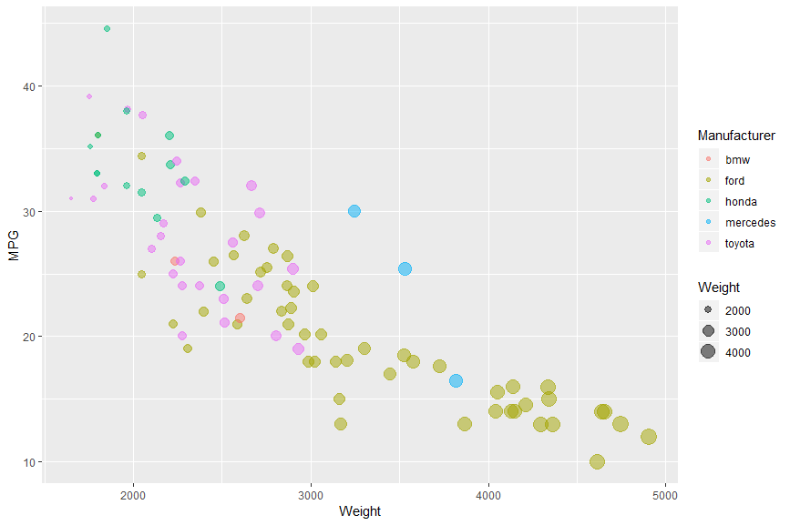
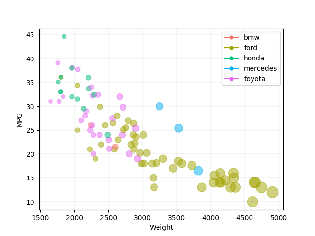
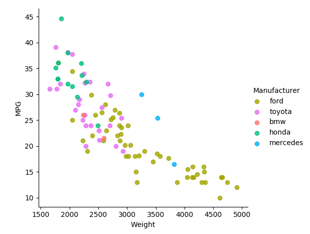
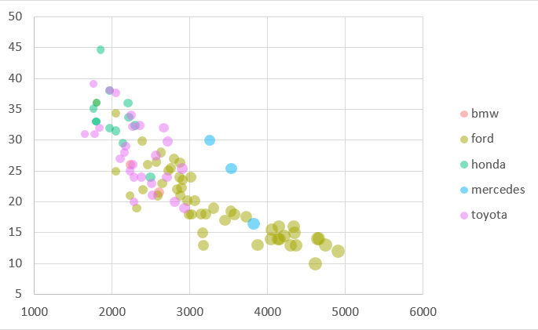
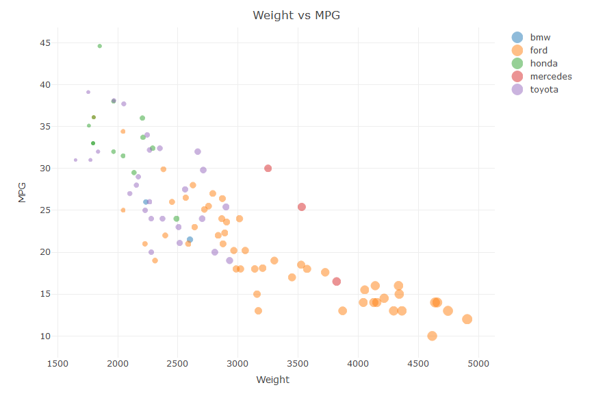
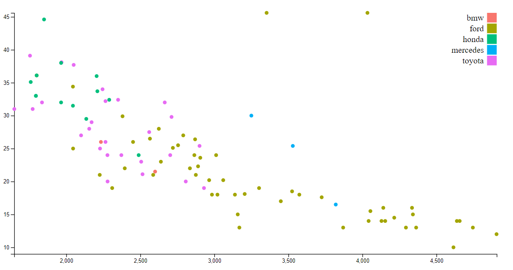
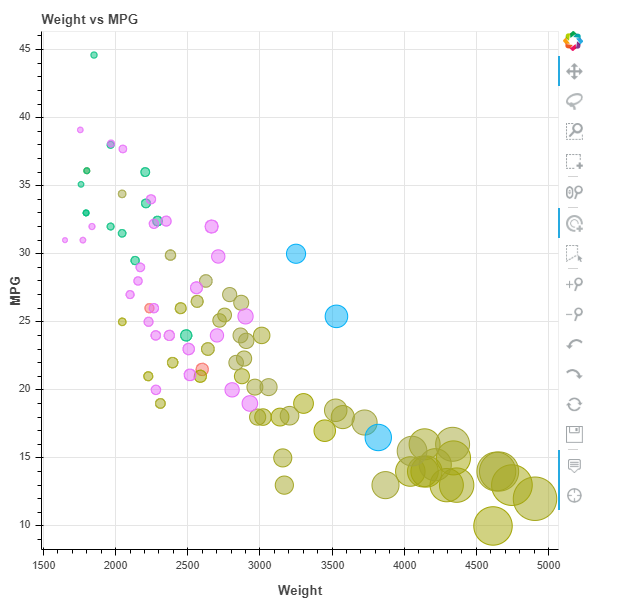
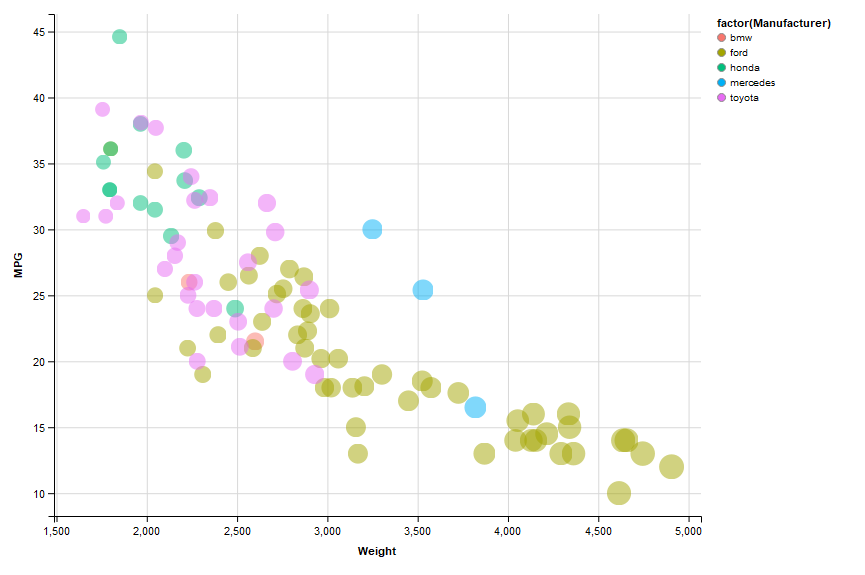
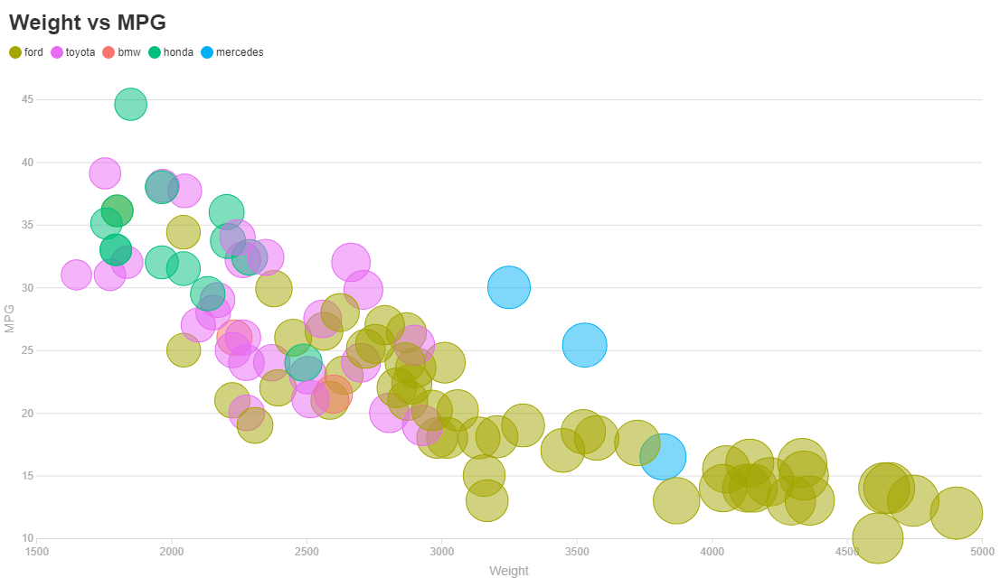

Name: Jimmy Tran
Username: jntran

#GGPLOT2

GGPLOT2 with R is actually pretty simple. It only took a few lines in order to get the picture up and runnning.
The only issue that took a bit is to get the working directory correct due to some issues with RStudio but it 
was fixed and should no longer be a problem. Like the example, I used geom_point() in order to make the graph. 

#matplotlib + pandas

Used Pandas as well in order to read the CSV file. Used LINE2D in order to customize my own legend due to how the data
was being read but works well and is simple. The scaling of the bubbles were a little more difficult for this one but it was not too bad
once I figured it out. Lambda worked pretty well in order to keep the colors of the manufacturers in the correct order. 
I got the colors based on ggplot's default colors and am using it to the best of my ability through the rest of this assignment.

#seaborn

Seaborn was very simple to implement. This was merely 3 lines of code, with one being an import, and one being an array to store
the colors used to make the graph. The API was very easy to look up and actually could be very useful in terms of figuring out
how to quickly graph based on a csv file. However, the problem is that i had to change my colors based around the order of the data 
points after the fact. of course, I could change the order of the csv file in order to change the order of the cars being plotted making
the legend be the same as the rest, however, I liked for it to not edit the csv.

#excel

This was also fairly simple as you can just select the data and have a scale (when using bubble chart) so all you would need to do is 
change around how it was displayed. However, to someone who may not have any coding experience, this may be easiest as it's all GUI based 
versus code based. The only thing that irked me however was the fact the colors were based on RGB and not hex, meaning I had to convert the 
HEX into RGB codes in order to keep the same color scheme as the rest of the charts.

#matplotlib + plotly

Plotly was also fairly simple to create the graph with while using R. It's very similar to matplotlib but applying the colors for the legend was
more similar to seaborn where I had to follow the same order that appeared but it didn't seem to work. Instead I editted the CSV table here in 
order to pair up the color with everything and will most likely use this new CSV in order to keep the color the same to reduce the amount of work
needed to code in the legend and focus more on the quality of the chart.

#d3
http://bl.ocks.org/weiglemc/6185069

This one required a lot of effort in order for me to do well. it required the most application and learning of code (even though it has been used
all class) for the graph to come out well. I made a mistake near the end about forgetting to change the numbers from the csv into an integer and 
wasted a lot of time trying to fix that issue when all I needed was a "+". I believe D3 had too much to do and implement in order to make a chart that
it would not be useful at all in order to quickly make data. However, being javascript, it has the potential to be very flexible in terms of interactivity
and aesthetics. I used this tutorial posted above but had to make numerous changes in order to move it from v3 to v5, the version that I'm using for 
d3.

#Bokeh

This one was also fairly simple and built-in are a lot of tools for interactivity. This may be the easiest one yet if it weren't for the fact that 
legends were much more difficult to create. When making graphs, I did not want to have to sort out the CSV or break apart each category by hand as
that could take a significant amount of time, especially when the data set is large. Making a legend without first breaking it is extremely difficult
and to my shame, I have spent way too much time on trying to make it. Besides the legend, the API allows for a huge amount of customization, including
what tools you want the user to have while viewing the chart.
Keep in mind that this exports to a .html file and that you would need to run that html file in order to view this chart.

#GGVis

This was one also fairly simple to implement, but finding out the documentation in order to keep the color scheme the way I wanted to was pretty obnoxious.
However, when it was found, it was simple to implement. I think ggplot2 is better to use however although this one did have some perks. Overall, it was slightly
more difficult than ggplot, but that worked completely fine for me.

#ScatterD3

This was actually a very simple one to implement. Not only did it allow you to choose variables that affect size and color, it also gave you a built-in option
to map your colors to specific variable names! I must have spent the least amount of time on this than any other way of plotting this dang chart. I definitely forsee
many companies using this (if they aren't already) in order to help plot some data. I have no idea whether or not it can be interactive yet, but I would not be surprised 
if it were.

#Flourish

Probably the first GUI (other than excel) that I've used to create the charts. This was as simple as uploading the data and then selecting what categories I wanted to use 
as the data points for the axis, and legend. It even allowed for scaling of the size of the dots. The colors were simple to add to make the correct color scheme as it was mainly
pairing up a key and value in a given box. It was very organized with a few different customization tools for the user to be able to create their chart. Looking through however,
there was not an option to move the legend to the right as I had wanted, but it still looks professional.

Technical Achievement:
Attempted to create legend for each one, some were easy, some were much harder to implement correctly. I know that it was not a requirement to add the legends and I can see why,
but decided to try it all of the way. I tried to use different styles of adding color and applying the correct color to the code in order to figure out different things, such as using lambda,
or just hard coding it into the code.

Design:
I kept the same color scheme (to the best of my ability) throughout all 10 plots. This prove to be difficult at times since the documentation isn't always clear on how to choose your own colors
and would choose default colors on it's own. Furthermore, even if the colors were added in, the package could be parsing the csv differently causing the order to be different than expected, forcing
me to rearrange the colors or do some hacks of my own to have the right color be on the right manufacturer.